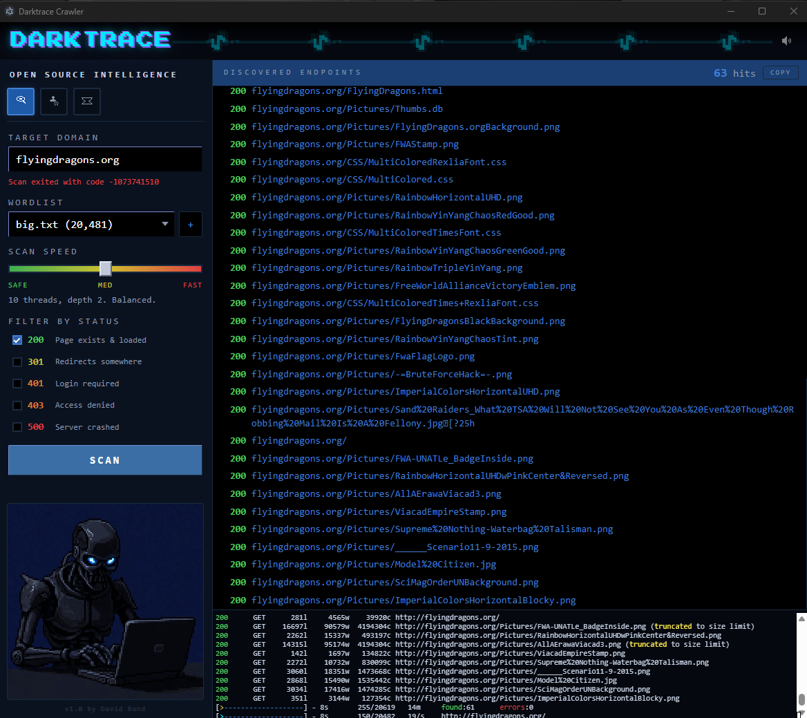

<p align="center">
  
</p>

<h1 align="center">DARKTRACE</h1>

<p align="center">
  <strong>Open Source Intelligence Toolkit</strong><br>
  <em>URL enumeration, username OSINT, and email reconnaissance in one desktop app.</em>
</p>

<p align="center">
  
  
  
</p>

---

<p align="center">
  
</p>

---

## What It Does

Darktrace wraps three powerful OSINT tools into a single Electron interface with real-time output, configurable scan profiles, and a built-in terminal view.

| Tool | Purpose | Backend |
|------|---------|---------|
| **URL Sniffer** | Discover hidden endpoints, directories, and files on a target domain | [feroxbuster](https://github.com/epi052/feroxbuster) |
| **Username OSINT** | Find accounts linked to a username across 500+ platforms | [maigret](https://github.com/soxoj/maigret) |
| **Email OSINT** | Check which services an email is registered on | [holehe](https://github.com/megadose/holehe) |

## Features

- **Three scan modes** with dedicated UI panels and progress tracking
- **Adjustable scan speed** — Safe / Medium / Fast presets controlling thread count and crawl depth
- **Status code filtering** — filter results by 200, 301, 401, 403, 500
- **Live terminal output** — raw feroxbuster output rendered via xterm.js
- **One-click copy** — export all discovered URLs to clipboard
- **Custom wordlists** — bundled defaults or import your own `.txt` files
- **Auto protocol detection** — tries HTTPS first, falls back to HTTP
- **Sound effects** — optional hit notification audio
- **First-scan warning** — reminds users about IP visibility and VPN usage

## Getting Started

### Prerequisites

- **Node.js** 18+
- **Python 3.10+** with `maigret` and `holehe` installed
- **feroxbuster** binary ([download](https://github.com/epi052/feroxbuster/releases))

### Install

```bash
git clone https://github.com/GiggleHacks/darktrace.git
cd darktrace
npm install
```

### Setup Binaries

Place these in the `assets/` directory:

```
assets/
  bin/
    feroxbuster.exe       # feroxbuster binary
  python/
    python.exe            # Python with maigret & holehe installed
    Scripts/
      holehe.exe
```

Or install them globally and Darktrace will find them on your PATH.

### Run

```bash
npm start
```

## Wordlists

Bundled in the `wordlists/` directory:

| File | Lines | Use Case |
|------|-------|----------|
| `common.txt` | ~4,600 | Quick scan, most common paths |
| `medium.txt` | ~11,000 | Balanced coverage |
| `big.txt` | ~20,400 | Thorough enumeration |
| `large.txt` | ~51,000+ | Deep scan |
| `raft-large-directories.txt` | Directories | Directory-focused wordlist |
| `raft-large-files.txt` | Files | File-focused wordlist |

You can also import any custom `.txt` wordlist using the **+** button.

## Disclaimer

This tool is intended for **authorized security testing and educational purposes only**. Scanning targets without explicit permission is illegal in most jurisdictions. Always obtain proper authorization before scanning any system you do not own.

The developers assume no liability for misuse of this software.

## Credits

**v1.0 by David Bond**

Built with [Electron](https://www.electronjs.org/), powered by [feroxbuster](https://github.com/epi052/feroxbuster), [maigret](https://github.com/soxoj/maigret), and [holehe](https://github.com/megadose/holehe).

## License

MIT
